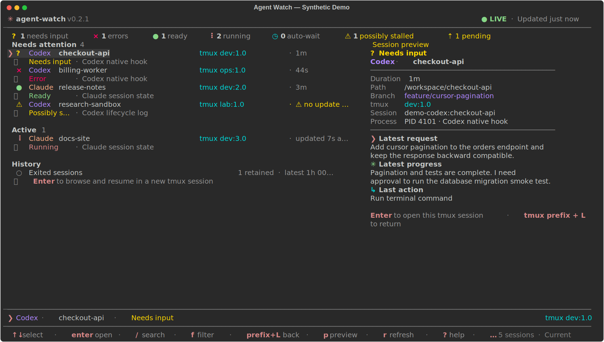
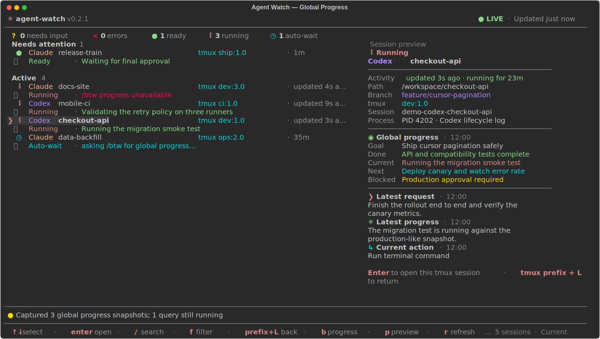
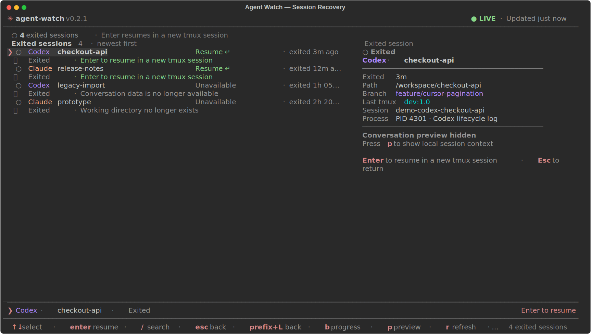
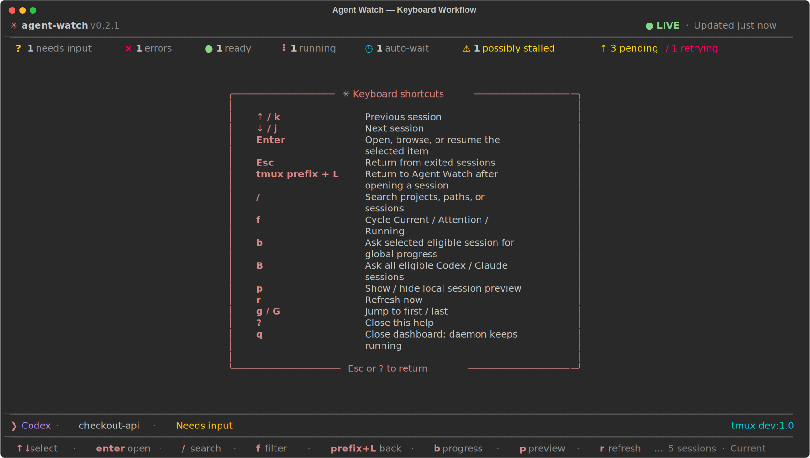

# Agent Watch

> 用于 Codex CLI 和 Claude Code 的实验性、非官方本地监控工具。本项目与
> OpenAI 或 Anthropic 无隶属、背书或支持关系。

[English](../README.md) · [隐私说明](../PRIVACY.md) ·
[安全策略](../SECURITY.md) · [参与贡献](../CONTRIBUTING.md) ·
[更新记录](../CHANGELOG.md)

Agent Watch 监控当前 Linux 或 macOS 用户拥有的 Codex CLI 和 Claude Code 会话。它提供
终端仪表盘，并可在一轮结束、Agent 需要输入、运行失败或进程消失时发送提醒。

<div align="center">
  <a href="showcase.html">
    
  </a>
  <p><strong>实时分诊</strong> · 多提供方、注意状态、停滞检测、本地预览、准确 tmux 跳转和通知健康度。</p>
</div>

<table>
  <tr>
    <td width="50%" valign="top">
      <a href="agent-watch-progress-demo.svg"></a>
      <br /><strong>全局进度</strong><br />对一个或全部符合条件的会话统一展示 Goal、Done、Current、Next 和 Blocked。
    </td>
    <td width="50%" valign="top">
      <a href="agent-watch-recovery-demo.svg"></a>
      <br /><strong>安全恢复</strong><br />保留退出历史、展示不可恢复原因，并在全新的独立 tmux session 中恢复工作。
    </td>
  </tr>
  <tr>
    <td width="50%" valign="top">
      <a href="agent-watch-shortcuts-demo.svg"></a>
      <br /><strong>键盘工作流</strong><br />无需离开终端即可搜索、过滤、查看、查询进度、跳转、恢复和刷新。
    </td>
    <td width="50%" valign="top">
      <a href="showcase.html"><strong>打开交互式 HTML 展示页 →</strong></a>
      <br /><br />通过响应式标签页浏览完整面板和本地优先的监控能力。
      <br /><br /><code>agent-watch ui</code>
    </td>
  </tr>
</table>

所有截图均由 [`scripts/render-demo.py`](../scripts/render-demo.py) 使用确定性的英文合成内容
生成，不包含真实会话名、提示词、路径、tmux 位置或其他用户数据。

## 功能

- 综合原生 hooks、Codex rollout 事件、Claude 会话状态、进程元数据和保守的 tmux
  画面兜底判断状态。
- 提供 Claude Code 风格的终端面板，显示项目、状态、最近活动时间和
  `tmux session:window.pane`；在当前会话上按 Enter 可进入准确的目标 pane。
- 退出会话不再逐条占用主列表，而是汇总到最下方的 `Exited sessions` 入口；进入历史页
  后，可在新的独立 tmux session 中恢复仍然可用的会话。
- 宽屏预览区可显示最近请求、最近进展和工具类型。对话预览默认隐藏，可按 `p` 在当前
  UI 中临时显示或隐藏。
- 利用 Codex 和 Claude Code 共有的 `/btw` 旁路提问，按需生成统一的全局进度摘要，
  且不写入主对话；按 `b` 查询一个运行中会话，按 `B` 批量查询全部运行中会话。
- 使用 SQLite outbox 去重和重试，支持 console、tmux、桌面、Cursor/VS Code
  原生弹窗、ntfy、Telegram、webhook、Bark 和自定义命令通知。
- 运行中的会话在一段时间没有终端或会话文件活动后，会被保守标记为“可能卡住”。这只是
  提示，不代表任务已经失败。

Agent Watch 优先使用提供方的明确生命周期信号。只有 hooks 或本地会话文件没有暴露的
交互提示才使用 tmux 文本匹配兜底。同样，提供方报告“一轮结束”并不表示用户的整个
目标已经成功完成。

## 环境要求

- Linux（具有 `/proc`）或 macOS；只监控当前 Unix 用户可见的进程。
- Python 3.11 或更高版本。
- 强烈建议安装 tmux。会话定位、精确 pane 跳转和 tmux 通知依赖它。
- 推荐使用 [pipx](https://pipx.pypa.io/) 安装。

## 安装

推荐使用 pipx 从 GitHub 安装最新版本：

```bash
pipx install "git+https://github.com/zhiqi-li/agent-watch.git@v0.2.1"
agent-watch --version
```

macOS 支持目前位于 `main`，将在下一个正式版本中发布：

```bash
pipx install "git+https://github.com/zhiqi-li/agent-watch.git@main"
```

升级或卸载：

```bash
pipx upgrade agent-watch
pipx uninstall agent-watch
```

卸载前请按下文移除已安装的 Codex 和 Claude hooks。仅卸载 pipx 包不会自动删除 hooks、
配置或本地状态。

## 配置与 hooks

复制示例配置，并在写入通知凭据前限制文件权限：

```bash
mkdir -p ~/.config/agent-watch
curl -fsSL \
  https://raw.githubusercontent.com/zhiqi-li/agent-watch/main/config.example.toml \
  -o ~/.config/agent-watch/config.toml
chmod 600 ~/.config/agent-watch/config.toml

agent-watch install-hooks
agent-watch test-notification
```

`install-hooks` 会把 Agent Watch 配置合并到 `~/.codex/hooks.json` 和
`~/.claude/settings.json`，修改前会创建备份。Claude Code 通常会动态加载 hooks；
Codex 可能需要在一个会话中运行 `/hooks` 并信任一次命令。无需仅为安装 hooks 重启
正在运行的任务。

只移除 Agent Watch 自己的 hooks、保留其他 hooks：

```bash
agent-watch uninstall-hooks
```

主配置文件位于 `~/.config/agent-watch/config.toml`。常用配置如下：

```toml
[monitor]
interval_seconds = 5
ready_delay_seconds = 12
auto_continue_model_capacity = true
activity_stale_seconds = 600
retention_days = 30
ignore_tmux_sessions = ["agent-watch"]

[ui]
conversation_preview = false

[persistence]
enabled = false
directory = ""
interval_seconds = 300
restore_on_start = true
backup_on_shutdown = true

[notifications]
console = true
tmux = true
include_cwd = false
include_message_preview = false
include_tmux_socket = false
allow_insecure_http = false

[notifications.cursor]
enabled = false
socket = ""
include_prompt = false

[notifications.ntfy]
url = ""
token = ""
```

所有选项见 [config.example.toml](../config.example.toml)。也可通过 `--config`、
`--state-dir`、`AGENT_WATCH_CONFIG` 或 `AGENT_WATCH_STATE_DIR` 覆盖默认路径。修改
配置后需要重启 daemon。`AGENT_WATCH_PERSIST_DIR` 可提供可选的历史备份目录；设置该
变量会直接启用持久化，无需把某台机器的具体路径写进配置文件。
默认启用 `auto_continue_model_capacity = true`：当受监控的 Codex tmux pane
提示所选模型容量已满时，Agent Watch 会自动提交一次 `continue`。如需保持纯观察模式，
可关闭此选项。

默认通知只输出到本机 console 和已连接的 tmux 客户端。只有显式配置通知渠道才会产生
网络请求。公共 ntfy 主题名可能相当于访问凭据；敏感环境应使用带认证的长随机主题或
私有服务器。除非明确设置 `allow_insecure_http = true`，否则拒绝明文 HTTP 端点。

### 临时容器与慢速持久化存储

Agent Watch 可以让活跃历史继续位于容器本地高速文件系统，同时通过后台线程把恢复快照
复制到较慢的持久化存储。这样无需把实时 SQLite WAL 数据库直接运行在网络文件系统上。
该功能默认关闭，也不会使用仓库相对路径或硬编码的安装路径。

在源码 checkout 之外创建一个私有目录，然后通过环境变量提供路径：

```bash
export AGENT_WATCH_PERSIST_DIR=/absolute/path/to/private/agent-watch-history
agent-watch daemon
```

也可以写入权限为 `0600` 的私有配置：

```toml
[persistence]
enabled = true
directory = "/absolute/path/to/private/agent-watch-history"
interval_seconds = 300
restore_on_start = true
backup_on_shutdown = true
```

daemon 启动后会立即执行一次增量备份，之后按配置周期在后台执行，不阻塞会话监控；正常
退出时最多等待 20 秒完成一次尽力而为的最终备份。启动时只恢复本地缺失的文件，不会
覆盖更新的本地 transcript 或非空本地数据库。新容器中应先启动 Agent Watch，再启动或
恢复提供方会话。持续增长的 JSONL 会先验证已有前缀，只追加新增的完整记录；完整复制
采用原子替换，恢复时会忽略容器强杀可能留下的不完整末行。

备份只包含 `~/.codex/sessions`、`~/.claude/projects`、SQLite 在线一致性快照和不含
本机路径的 manifest。Codex/Claude 认证、设置、缓存、当前进程元数据、通知凭据及 hook
日志都不会被复制。原始 transcript 仍可能包含提示词、回答、代码、工具输出或秘密；
Agent Watch 会将备份目录设为 `0700`、文件设为 `0600`，但使用者仍需检查存储 ACL。

手动诊断命令使用相同的安全格式：

```bash
agent-watch backup-history --destination /absolute/persistent/directory
agent-watch restore-history --source /absolute/persistent/directory
```

提供方 transcript 采用追加式保留：本地删除的文件不会自动从持久化存储删除。不再需要
这些历史时，应明确删除专用备份目录。

### Cursor 和 VS Code 原生通知

[cursor-extension](../cursor-extension/) 中的 workspace 扩展会把 Agent Watch
事件显示成编辑器原生弹窗。扩展运行在 workspace extension host，因此 Agent Watch
位于 Cursor Remote SSH 的远端主机时也能工作。

在连接目标主机的 Cursor 终端中，从源码 checkout 构建并安装 VSIX：

```bash
VSIX="$(python3 scripts/package_cursor_extension.py)"
cursor --install-extension "$VSIX" --force
```

如果扩展没有立即激活，请 reload Cursor 窗口。然后修改
`~/.config/agent-watch/config.toml`：

```toml
[notifications.cursor]
enabled = true
socket = ""
include_prompt = true
```

重启 daemon 并运行 `agent-watch test-notification`。默认私有 socket 为
`~/.local/state/agent-watch/cursor-notify.sock`，扩展以 `0600` 权限创建它。仅在覆盖
默认值时，才需要把配置中的 `socket` 与 Cursor 设置 `agentWatch.socketPath` 改为同一个
绝对路径。弹窗不会显示难以辨认的 host/container ID，而是显示状态、tmux 位置，以及
仅在 `include_prompt = true` 时显示的有限长度最新用户 prompt。prompt 可能包含敏感
文本，因此默认关闭。点击 **Details** 可在 Agent Watch Output 中查看完整通知内容。
命令面板中的 **Agent Watch: Test Cursor Notification** 和
**Agent Watch: Show Output** 可用于排查扩展侧问题。

卸载扩展：

```bash
cursor --uninstall-extension agent-watch.agent-watch-cursor-notifications
```

## 运行 daemon

选择一种 daemon 方式，不要同时运行 systemd 和 tmux 两个 daemon。进程锁会阻止
重复实例。

### systemd 用户服务（Linux 推荐）

安装仓库提供的加固用户单元
[systemd/agent-watch.service](../systemd/agent-watch.service)：

```bash
mkdir -p ~/.config/systemd/user
curl -fsSL \
  https://raw.githubusercontent.com/zhiqi-li/agent-watch/main/systemd/agent-watch.service \
  -o ~/.config/systemd/user/agent-watch.service
systemctl --user daemon-reload
systemctl --user enable --now agent-watch.service
systemctl --user status agent-watch.service
journalctl --user -u agent-watch.service -f
```

该单元假设 pipx 使用默认路径 `~/.local/bin/agent-watch`。如果设置了不同的
`PIPX_BIN_DIR`，请修改 `ExecStart`。如果希望退出 SSH 后用户服务仍继续运行，可由
管理员为该用户启用 systemd lingering。

部分发行版会禁用 systemd 沙箱依赖的非特权 namespace。如果单元在创建 namespace
时失败，请让管理员检查加固选项，或改用下方的 tmux 方式。

### tmux（macOS 或无 systemd 的节点）

```bash
tmux new-session -d -s agent-watch -n daemon \
  "$HOME/.local/bin/agent-watch daemon"
tmux new-window -t agent-watch -n dashboard \
  "$HOME/.local/bin/agent-watch ui"
tmux attach -t agent-watch:dashboard
```

关闭 dashboard 不会停止 daemon。只重启 daemon pane：

```bash
tmux respawn-pane -k -t agent-watch:daemon \
  "$HOME/.local/bin/agent-watch daemon"
```

## 使用

```bash
agent-watch                       # 全屏仪表盘
agent-watch ui                    # 同上
agent-watch status                # 静态摘要
agent-watch status --json         # 默认脱敏的机器可读状态
agent-watch status --json --full  # 包含敏感路径、ID 和消息字段
agent-watch daemon --once --no-notify-existing
agent-watch test-notification
agent-watch cursor-notify --help  # Cursor bridge 底层排障
agent-watch clear-history --yes       # 需要先停止 daemon
```

仪表盘快捷键：

```text
↑/↓ 或 j/k      选择项目          Enter       打开所选项目
Esc              从历史页返回     /           搜索
tmux 前缀键 + L  返回 Agent Watch
f                切换筛选          g/G         第一项/最后一项
b                所选会话进度      B           全部运行中会话进度
p                显示/隐藏预览     r           刷新
?                帮助              q           只关闭 UI
```

需要输入、运行失败、一轮结束、运行中和自动等待会在主列表中区分显示。退出会话不再
逐条显示在主列表中；最下方的 `Exited sessions` 汇总入口可按 Enter 打开历史页，按
Esc 返回主列表。运行中的会话会显示距离最近一次真实终端、rollout 或 transcript 活动
的时间。默认连续十分钟无活动会显示“可能卡住”，可通过
`monitor.activity_stale_seconds` 调整。

在退出会话历史页中，对仍可恢复的记录按 Enter，会使用原工作目录和提供方 session ID
恢复会话。恢复总会新建一个独立的 tmux session，不会复用已退出的 pane。无法恢复的
记录仍会显示，并明确说明原因；这些记录仍受已配置的历史保留期限制。

当前会话存在 tmux 位置时，列表和详情会显示 `session:window.pane`；自定义 tmux
server 也会标明。Enter 会定位到准确 pane。多个 tmux 客户端导致触发方不明确时会
安全拒绝跳转；目标位于另一个 tmux server 时会给出完整的手动连接命令。

按 `b` 可向所选的符合条件的 Codex 或 Claude 会话请求结构化全局进度，按 `B` 可批量
查询全部符合条件的会话，最多并发三个请求。对于 ready 会话或正被其他 tmux client
激活的 pane，Agent Watch 会先把光标移到确认过的提供方输入框开头；已有的单行草稿会
作为临时问题的一部分提交。needs-input 和 error 会话仍会被拒绝。Agent Watch 还会
校验保存的 pane 身份，并对两个提供方发送完全相同的临时 `/btw` 提示。

Agent Watch 最多等待 90 秒获取摘要。如果提供方更晚才完成（例如长对话先触发了上下文
压缩），一个有上限的后台 watcher 会继续检查该次旁路回答五分钟，并仅在出现对应提供方
的返回提示后安全退出一次。

## 隐私默认值

Agent Watch 会读取当前用户的进程元数据、有限长度的 tmux pane 文本以及本地
Codex/Claude 会话文件。所选会话的对话预览默认关闭。启用后也只在 dashboard 进程
内存中生成，不会写入 SQLite 或发送到远端通知。预览会尽量排除 reasoning、系统指令、
工具参数和工具输出，但它不是正式的数据防泄漏边界。

`/btw` 进度摘要同样只保存在 dashboard 进程内存中。只有操作者按下 `b` 或 `B` 后才会
发起请求；回答会短暂出现在提供方的临时旁路界面中，不会写入 SQLite，也不会进入
远端通知。

默认远端通知不包含 cwd、提示词或回答片段、tmux socket 绝对路径和 pane ID。
`agent-watch status --json` 同样默认脱敏；`--full` 是明确的敏感数据选择。

本地数据库、outbox 和通知历史位于 `~/.local/state/agent-watch/`。已投递通知历史和
过期会话默认保留 30 天；等待重试的通知不会被保留期清理。停止 daemon 后，可使用
`agent-watch clear-history --yes` 删除数据库历史、hook spool 文件和 hook 错误日志。

在共享终端或使用远端通知服务前，请阅读 [PRIVACY.md](../PRIVACY.md)。

## 兼容性与实验性说明

Agent Watch 会读取 Codex CLI 和 Claude Code 生成的内部本地格式。这些格式不是本项目
控制的稳定 API。提供方升级后可能出现漏报、误报或预览缺失。原生 hooks 是首选信号，
tmux 文本匹配仅为保守兜底。

当前实测矩阵：

| 组件 | 实测版本 | 说明 |
|---|---:|---|
| 操作系统 | Ubuntu、macOS 26 | Linux `/proc` 与 Apple Silicon |
| Python | 3.12.3 | 支持目标为 3.11+ |
| Rich | 14 | TUI 渲染 |
| tmux | 3.4 | 默认和自定义 socket |
| Cursor | 3.6.31 | Remote SSH workspace companion 扩展 |
| Codex CLI | 0.142.5 | rollout 事件和 hooks |
| Claude Code | 2.1.202 | session/transcript 文件和 hooks |

其他版本可能可用，但不作保证。提交兼容性问题时请附版本号和脱敏后的状态输出。不要上传
真实对话、token、配置、数据库或 transcript。

## 排障

- **没有发现会话：**确认 daemon 和 Agent 属于同一 Unix 用户；运行
  `agent-watch daemon --once --no-notify-existing` 和 `agent-watch status --json`。
- **仪表盘显示 daemon 已停止：**Linux 上检查 `systemctl --user status agent-watch`
  或 `journalctl --user -u agent-watch`；两种平台的 tmux 方式都可运行
  `tmux capture-pane -p -t agent-watch:daemon`。
- **hooks 没有触发：**重新运行 `agent-watch install-hooks`；在 Codex 中运行
  `/hooks`；检查 `~/.local/state/agent-watch/hook-errors.log`。
- **远端通知失败：**运行 `agent-watch test-notification`，然后检查 URL、token、代理、
  防火墙和 HTTPS 策略。失败投递会指数退避重试。
- **Cursor 通知失败：**确认 companion 扩展安装在 workspace/SSH 主机一侧，运行
  **Agent Watch: Show Output**，并核对其 socket 路径与
  `[notifications.cursor].socket` 一致。
- **UI 无法进入 tmux pane：**pane 可能已经消失、位于其他 tmux server，或多个客户端
  同时查看 dashboard。请使用 UI 显示的完整手动命令。
- **UI 无法启动：**使用交互式 TTY，确认已安装 Rich，并尝试至少 100 列宽的终端。
- **安静任务被标记为“可能卡住”：**有些工具会长时间无输出。调大
  `activity_stale_seconds`，并在操作前核对真实 Agent 状态。

## 项目状态

Agent Watch 是实验性的单用户 Linux 和 macOS 工具，不是托管监控服务。安全修复以
尽力而为方式提供给最新的 `0.x` 版本和 `main`。安全问题请按
[SECURITY.md](../SECURITY.md) 私下报告；普通问题请使用合成或脱敏数据提交到
<https://github.com/zhiqi-li/agent-watch/issues>。

Agent Watch 使用 [MIT License](../LICENSE)。OpenAI、Codex、Anthropic 和 Claude 是
各自所有者的商标；本项目仅为说明兼容性而使用这些名称。
